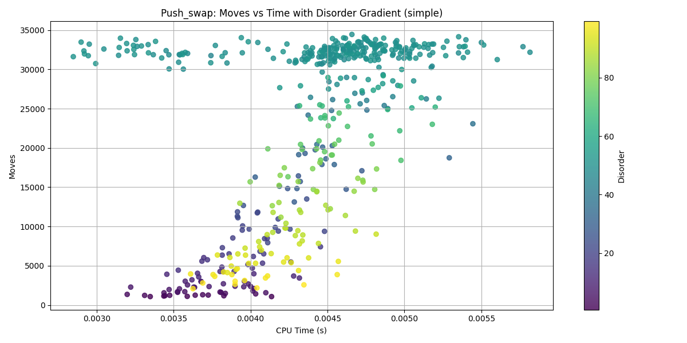
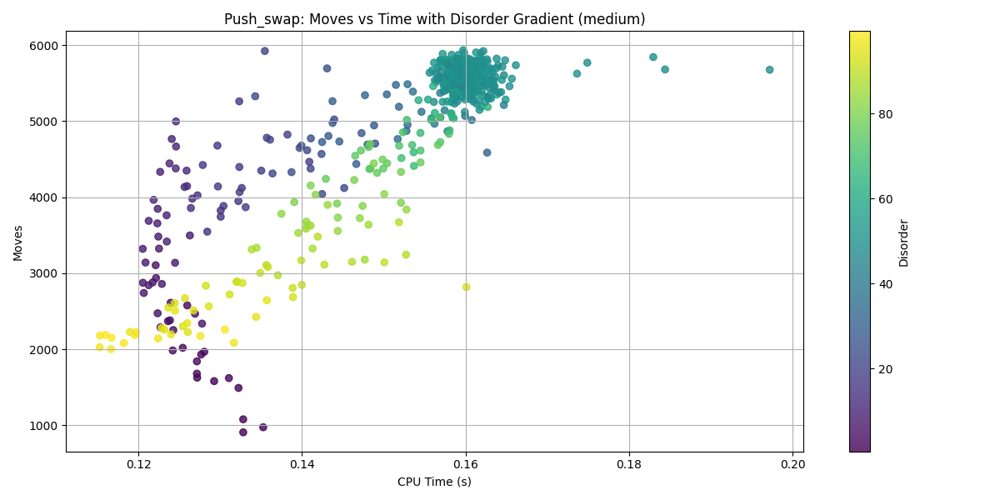
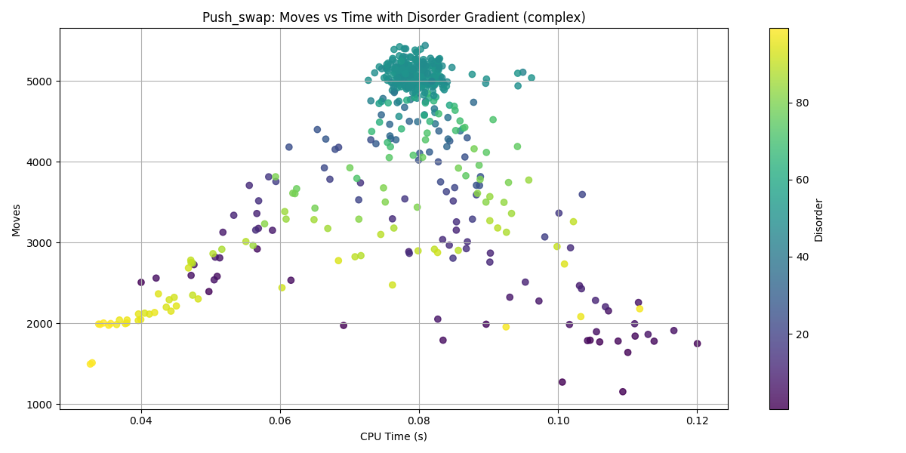

*This activity has been created as part of the 42 curriculum by yaichi, mberraho*

# Push_Swap

## Description

`push_swap` is a constrained sorting project from the **42 curriculum**.

The objective is to sort a sequence of **unique integers** initially stored in **stack A** using a second stack **B** and a **restricted set of stack operations**.

Instead of focusing on classical algorithmic complexity (CPU time), the challenge is to **minimize the number of operations produced** while still generating a valid sequence that sorts the stack.

The program receives numbers as arguments and prints a list of operations that, when executed, will transform the initial stack into a sorted stack.

Key constraints:

- Only **specific stack operations** are allowed.
- The program must produce **as few operations as possible**.
- Inputs must be **valid 32-bit signed integers** with **no duplicates**.

This project emphasizes:

- algorithm design under constraints,
- data structure invariants,
- operation cost optimization,
- robust input parsing.

---
## Instructions

### Compilation

```bash
make
````

This produces the executable:

```
./push_swap
```

Clean build artifacts:

```bash
make clean
make fclean
make re
```

---

### Execution

Example usage:

```bash
./push_swap 3 2 1
```

Output:

```
sa
rra
```

The output is a **sequence of operations** that sorts the input.

Example with many values:

```bash
ARG=$(shuf -i 1-100 -n 100 | tr '\n' ' ')
./push_swap $ARG
```

To verify correctness with a checker:

```bash
ARG=$(shuf -i 1-100 -n 100 | tr '\n' ' ')
./push_swap $ARG | ./checker $ARG
```

Expected output:

```
OK
```

---

### Allowed Operations

#### Swap

```
sa   swap first two elements of stack A
sb   swap first two elements of stack B
ss   sa and sb simultaneously
```

#### Push

```
pa   push top of B onto A
pb   push top of A onto B
```

#### Rotate

```
ra   rotate A upward
rb   rotate B upward
rr   ra and rb simultaneously
```

#### Reverse Rotate

```
rra  rotate A downward
rrb  rotate B downward
rrr  rra and rrb simultaneously
```

Each operation runs in **O(1)** time because only stack pointers are modified.

---

## Project Architecture

The project is structured into three major components:

1. **Parser** implemented as a **finite state machine**
2. **Stack data structure** implemented as a **circular doubly linked list**
3. **Sorting algorithms** based on insertion strategies and greedy cost evaluation

```
Parser
   ↓
Stack construction
   ↓
Index compression
   ↓
Sorting strategy
   ↓
Operation log output
```

---

## Global Invariants

### Stack Structure Invariants

The stack is implemented as a **circular doubly linked list**.

Rules:

* If `length == 0`

  * `head == NULL`
  * `tail == NULL`

* If `length == 1`

  * `head == tail`
  * node points to itself

* If `length > 0`

  * `tail->next == head`
  * `head->previous == tail`

Operations `ra`, `rb`, `rra`, `rrb` only update **head/tail pointers** without changing the topology.

---

### Data Invariants

All stack elements follow these rules:

* values are **valid 32-bit signed integers**
* values are **unique**
* each node receives an **index** representing its rank in the sorted order

```
index ∈ [0, n-1]
```

Using indices simplifies comparisons and enables efficient sorting strategies.

---

### Output Invariants

* Only operations must be written to **stdout**.
* Every printed operation must correspond to a **real stack modification**.

---

## Parser Design

The parser reads the input using a **finite state machine (FSM)**.

### Input Assumptions

The parser processes:

* digits
* spaces
* `-` sign
* options such as:

```
--simple
--medium
--complex
--adaptive
--bench
```

A valid number is a **signed base-10 integer within 32-bit limits**.

---

### Parser States

```
InStart
InDash
InOption
InSpace
InNumber
InInvalid
InSuccess
```

Each state handles events:

```
digit
letter
space
dash
end of input
invalid character
```

Handlers process the character and determine the **next state**.

---

### Parser Invariants

* `InInvalid` is **absorbing** (no transition back).
* `start_number` points to the beginning of the current numeric token.
* When a number ends:

  * it is converted with `ft_patol`
  * range is checked
  * duplicates are rejected
  * value is inserted into `stack_a`.

If an error occurs:

```
print "Error"
free all memory
exit
```

---

## Sorting Algorithms

### Simple Insertion Sort

#### Idea

Repeatedly move the **minimum element of A** into B.

#### Steps

1. Assign indices.
2. Find minimum position in `A`.
3. Rotate shortest path.
4. `pb`
5. Repeat until `A` empty.
6. Push everything back with `pa`.

#### Complexity

CPU complexity:

```
O(n²)
```

Operation count:

```
O(n²)
```

This algorithm serves mainly as a **baseline implementation**.

---

### LIS-Based Insertion

#### Idea

Preserve the **Longest Increasing Subsequence (LIS)** inside stack `A`.

Only elements **not belonging to the LIS** are moved to stack `B`.

#### Invariants

* LIS elements remain in `A`.
* non-LIS elements move to `B`.
* `B` remains **circularly descending**.
* `A` remains **circularly ascending** during reinsertion.

#### Steps

1. Compute LIS and mark nodes.
2. Push non-LIS elements to `B`.
3. Reinsert elements into `A` at optimal positions.
4. Final rotation to place minimum at top.

#### Complexity

CPU complexity:

```
O(n³) worst case
```

Operations produced:

```
≈ O(n²)
```

Often better than simple insertion because fewer elements are moved.

---

### Greedy Cost-Based Insertion

This is the **main algorithm used in the project**.

#### Idea

At each step:

1. Evaluate the **cost of moving every element** from `A` to `B`.
2. Select the **cheapest candidate**.
3. Execute rotations with combined operations when possible.

---

#### Cost Computation

For each element:

```
cost = max(|cost_a|, |cost_b|)
```

where:

```
cost_a = rotations needed in A
cost_b = rotations needed in B
```

Combined rotations reduce operations:

```
rr
rrr
```

---

### Algorithm on n < 4

1. Handle `n ≤ 3` with direct sorting.
2. Assign indices.
3. While `|A| > 3`:

```
evaluate cost for every element
select minimal cost candidate
execute combined rotations
pb
```

4. Sort remaining 3 elements in `A`.
5. Reinsert `B → A`.
6. Rotate `A` to place the smallest element on top.

---

### Complexity

CPU complexity:

```
O(n³) worst case
```

Operations produced:

```
O(n²) worst case
```

In practice, the constant factor is very low and the algorithm behaves closer to:

```
≈ O(n log n)
```

for typical random inputs.

---

## Benchmarks

Typical thresholds used in the 42 evaluation:

| Input size  | Very good score   |
| ----------- | ----------------- |
| 100 numbers | < 700 operations  |
| 500 numbers | < 5500 operations |


### Measured Average Results for n = 500

Data and python simulation script are in he folder `./Perf`

| Algorithm  | Average Moves | Average Time (s) |
|------------|---------------|------------------|
| Simple     | 22492.87      | 0.0044           |
| Medium     | 4764.24       | 0.1505           |
| Complex    | 4256.99       | 0.0777           |

### Measured Results for n = 100

| Algorithm  | Average Moves | Average Time (s) |
|------------|---------------|------------------|
| Simple     | 1123.95       | 0.0017           |
| Medium     | 555.53        | 0.0048           |
| Complex    | 505.78        | 0.0031           |


---

## Performance plot

### Simple Mode


### Medium Mode


### Complex Mode


---

## Reusable Components

Several components are designed to be reusable in other projects:

* finite state machine parser
* circular doubly linked list
* dynamic operation log
* index compression
* disorder metrics for strategy selection
* benchmarking tools

---

# Resources

### Documentation

* 42 push_swap subject
* state machine : https://gameprogrammingpatterns.com/state.html
https://www.adamtornhill.com/Patterns%20in%20C%202,%20STATE.pdf
* GeeksforGeeks articles on stack operations
* LIS : https://cp-algorithms.com/dynamic_programming/longest_increasing_subsequence.html#restoring-the-subsequence

### Concepts Used

* greedy algorithms
* longest increasing subsequence
* circular linked lists
* operation cost modeling
* finite state machines

---

## AI Usage Disclosure

AI tools were used as **engineering assistants**, specifically for:

* documentation structuring
* clarifying algorithm explanations
* improving README organization
* reviewing technical explanations

All **design decisions, algorithms, and implementations** were developed and written manually.
